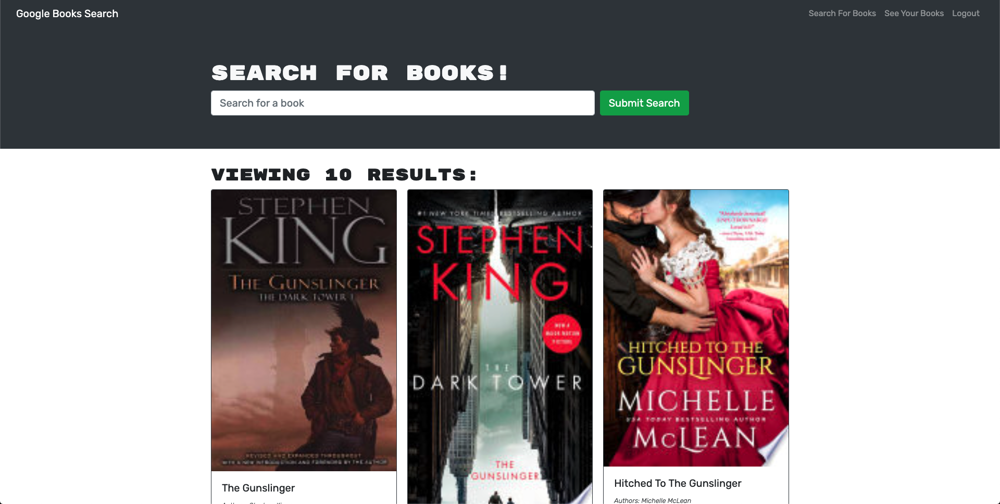

# [Book Search Engine](https://pacific-retreat-93346.herokuapp.com/)

 

## Description

The Book Search Engine is an app that used to use RESTful API routes until I refactored it to use the Apollo Server with GraphQL. It has a React front end, a MongoDB database, and a Node/Express server.

It allows a user to search books using the Google Books API. It also allows a user to make an account, and when logged in a user can save books to reference at a later time.

Book search results include the book's cover, title, author(s), and a description. Saved books can be deleted from the saved books page, which is available to logged in users.

---

## Table of Contents

1. [Installation](#installation)
2. [Usage](#usage)
3. [Contributing](#contributing)
4. [License](#license)
5. [Questions](#questions)

---

## Installation

1. `npm run install`

2. `npm run develop` to start a development build (server and client)

---

## Usage

1. If running locally, use `npm run develop` if testing and `npm run build` and `npm start` to create a production build and start the server.

2. Access the Heroku-deployed version of the app [here](https://pacific-retreat-93346.herokuapp.com/).

3. Input an author or book title in the input field.

4. Peruse the generated list of books.

5. Create an account by clicking Login/Sign Up in the corner.

6. When logged in, there will be a "Save Book" button at the bottom of every book result. Click this button to save the book to your saved books list.

7. Access your saved books list by clicking the "See Your Books" link in the upper right.

8. Delete a book from your saved books list by clicking the delete book button.

9. Enjoy the exhilirating experience that is literary art.

 

---

## Contributing

Any contributions that conform to the [Contributor Covenant Code of Conduct](https://www.contributor-covenant.org/version/2/1/code_of_conduct/) are welcome!

---

## License

MIT License

Copyright &copy; 2022 Christian Sadler

Permission is hereby granted, free of charge, to any person obtaining a copy
of this software and associated documentation files (the "Software"), to deal
in the Software without restriction, including without limitation the rights
to use, copy, modify, merge, publish, distribute, sublicense, and/or sell
copies of the Software, and to permit persons to whom the Software is
furnished to do so, subject to the following conditions:

The above copyright notice and this permission notice shall be included in all
copies or substantial portions of the Software.

THE SOFTWARE IS PROVIDED "AS IS", WITHOUT WARRANTY OF ANY KIND, EXPRESS OR
IMPLIED, INCLUDING BUT NOT LIMITED TO THE WARRANTIES OF MERCHANTABILITY,
FITNESS FOR A PARTICULAR PURPOSE AND NONINFRINGEMENT. IN NO EVENT SHALL THE
AUTHORS OR COPYRIGHT HOLDERS BE LIABLE FOR ANY CLAIM, DAMAGES OR OTHER
LIABILITY, WHETHER IN AN ACTION OF CONTRACT, TORT OR OTHERWISE, ARISING FROM,
OUT OF OR IN CONNECTION WITH THE SOFTWARE OR THE USE OR OTHER DEALINGS IN THE
SOFTWARE.

---

## Questions

If you have questions, contact me on [GitHub](https://github.com/Chrisaeus) or send me an e-mail at <christian.sadler@yahoo.com>.